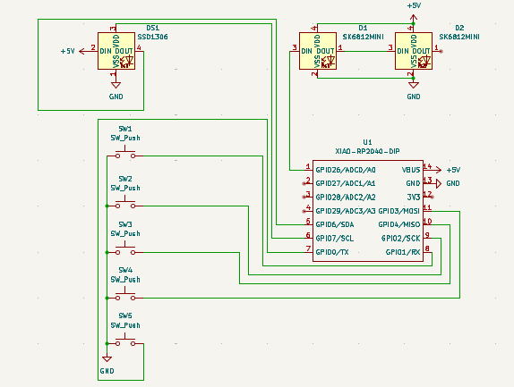
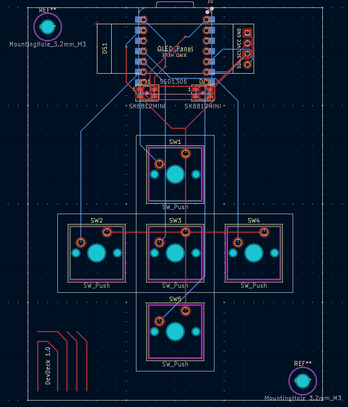

# DevDeck-MacroPad
The DevDeck is a smallish MacroPad designed to make programming more efficient.
It has 5 switches, two LED status lights, an OLED screen to display some info, and uses circuitpython with some libraries as the firmware.
---
# Features

* 5 Switches for doing macros,
* 128x32 Oled display,
* 2 SK6812 Mini E LED lights,
* Custom firmware including a host.py for further customization post building.
---
# CAD

Made in Fusion360 with blood, sweat, tears, and hours of revisions.

---
# PCB

Made in Kicad 9.0

### Schematic

I used an SK6812 on the schematic as a stand in for the OLED, as I didn't have a symbol for it.



### PCB


---
# Firmware

As this is my first time ever designing/building hardware, and have never made firmware for anything in my life, I used ChatGPT as a help (all the ideas for what does what and how stuff work (so the basic logic) came from me).

The firmware has by default 4 layers for the macro keys:
1. Edit
	1. Cut
	2. Copy
	3. Paste
	4. Undo
	5. Redo
2. Git control
	1. `git add .`
	2. `git commit -m ""`
	3. `git push origin main`
	4. `git pull`
	5. `git init`
3. Code snippets
	1. ```python
    	try:  
			...  
		except:  
			...
	2. ```python
    	while True:  
			...
	3. ```python
    	def main():  
			...
	4. ```python
    	if ...:  
			...  
		elif ...:  
			...  
		else:  
			...
	5. ```python
    	from time import sleep as delay  
		while True:  
			try:  
				main()  
			except KeyboardInterrupt:  
				print("\nGoodbye", end="", flush=True)  
				delay(0.5)  
				print(".", end="", flush=True)  
				delay(0.5)  
				print(".", end="", flush=True)  
				delay(0.5)  
				print(".", end="", flush=True)  
				delay(0.5)  
				exit(0)  
4. Window control
	1. win + up arrow
	2. win + left arrow
	3. win + d
	4. win + right arrow
	5. win + down arrow

To switch between macro layers you hit the middle(3) and either the left(2) or right(4) switches to go back and forward in the macro layers, respectively.  

The screen by default just shows what macro layer you're currently on.  
(if you add layers to the screen it still shows the current macro layer name on the top, plus the two lines of text you added (currently only supports text).  
To switch between screen layers you hit the middle(3) and either the top(1) or bottom(5) switches to back and forward in the screen layers, repectively.)

### Host.py
I added functionality to change or even add layers to the macropad using the host.py file.
You can add and change both the the macro layers, and the screen layers.
I tried to make it as user-friendly as possible, so whoever is using it can do so with ease.
---
# BOM

* 1 3D printed case
* 1 PCB
* 1 Seeed XIAO RP2040
* 5 Cherry MX switches
* 5 DSA keycaps
* 2 SK6812 Mini E LED lights
* 1 0.91" 128x32 OLED display
* 4 M3 Heatset inserts
* 4 M3x16 SCHS bolts
